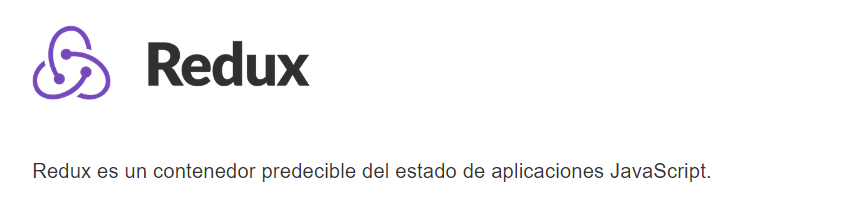
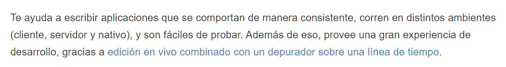

Después te aprender a manejar **React**, es completamente normal -quizás hasta predecible- que vas a comenzar a leer acerca de **Redux**. Después de un vistazo a su documentación, es probable que salgas con mas preguntas que respuestas, pero es difícil culparte. Según la página oficial, podríamos usar la siguiente definición:

 Hmm??? 

Al saber **React**, seguramente estarás familiarizado con el concepto de *state*, pero el resto de esas palabras parecen no pertenecer a una misma oración coherente. Bueno, al menos al principio. Afortunadamente, el siguiente párrafo contiene información un poco más clara:

 Ahhhh, bueno 

Si revisas la documentación de **Redux** un poco mas a fondo, vas a ver esta frase una y otra vez:

>**Redux** será la fuente de verdad para tus datos

Al estar los componentes tan fragmentados -y esto es apropósito- es muy fácil que el comunicar el state entre ellos se vuelva una tarea innecesariamente complicada. En otras palabras, **Redux** nos puede ayudar a mejorar y optimizar la comunicación del state entre nuestros componentes al ser la única fuente de state y sus mutaciones. Una fuente única de verdad.

Y no hace falta ir muy lejos para ver que **Redux** es un absoluto monstruo del mundo de web development y ciertamente dentro del ecosistema de **React**. Tan es así el caso, que mas del 60% de las apps de **React** en producción utilizan **Redux**. ¡Eso es muchísimo! 

La cifra anterior es de acuerdo a Mark Ericsson, quien es uno de los mantenedores de **Redux**. La figura anterior se vuelve incluso más impresionante al notar que no se están tomando en cuenta alternativas a **Redux** como lo son la popular MobX.

Soy de la opinión que manejar el state de tu app (incluso si no es de **React**) con una librería como **Redux** es inteligente, ya que, de entrada, provee un sistema bastante explicito para manejar el state de tus apps, eso sin tomar en cuenta lo bien que tus apps irán escalando y lo organizado de tu código al usar **Redux** exclusivamente.

###En conclusión... 

¿Es **Redux** absolutamente necesario para tus apps de **React**? No, pero usarlo termina casi siempre siendo una muy buena idea. Al principio es probable -tal vez hasta preferible- que puedas manejar todo con *setState()*, pero si tu app es de tamaño medio a grande, vas a llegar a la conclusión de que utilizar **Redux** es una buena inversión de tu tiempo.

Debo de mencionar el hecho de que hay susurros de que la nueva *Context API* presente en React a partir de la version 16.5 va a causar que muchos pongan a Redux y a otras librerías similares de lado. Pero como cualquier tecnología nueva, va a tomar un tiempo en volverse el nuevo estándar, incluso si es el reemplazo definitivo de **Redux**, lo cual no estoy convencido que lo sea.

***

**Referencias:**

* [Documentación de Redux en Español](https://es.redux.js.org)
* [Redux - Not Dead Yet!](https://blog.isquaredsoftware.com/2018/03/redux-not-dead-yet/)