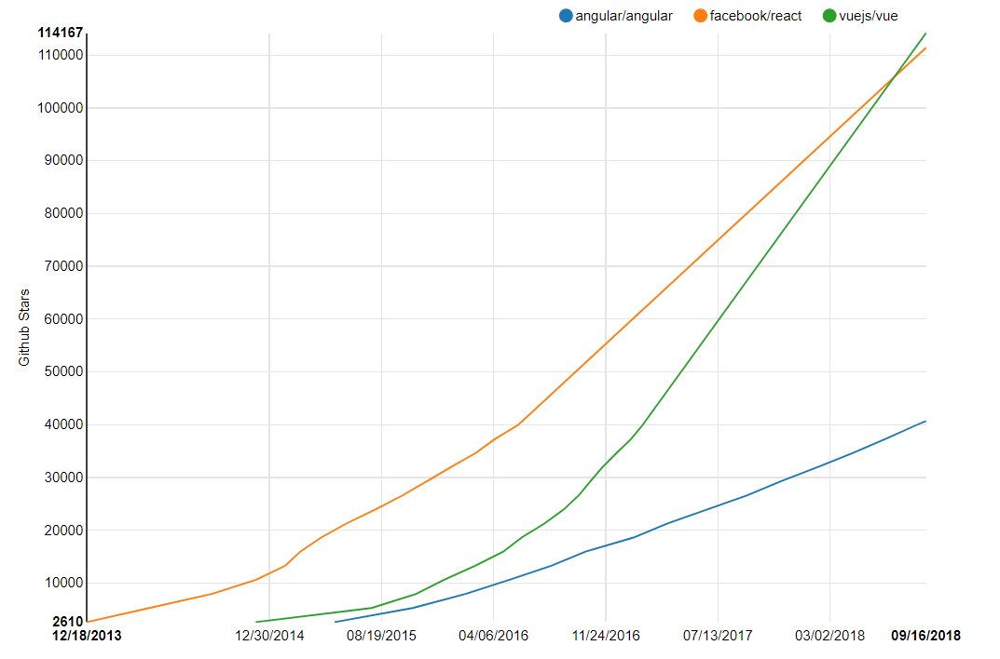

La manera en cómo **React** se ha apropiado del mundo del web development ha sido impresionante. Esto se le puede achacar a muchos factores, ciertamente **React** tuvo mucha ayuda de varios lugares y el hecho de que este proyecto sea respaldado por la gente de Facebook ayudo a que muchos developers decidieran dar el salto inicial hacia **React**.

En este mundo que se mueve tan rápido, es fácil en ocasiones el perder el sentido del tiempo. No era hace mucho que **Angular** era el rey indiscutido del mundo del web development. Pero de repente, paso algo que pocos esperaban. Google, la compañía detrás de **Angular**, decidió que, para conmemorar el lanzamiento de su segunda versión, **Angular 2**, iban a reescribir todo el framework desde cero, básicamente haciendo instantáneamente obsoleta la primera versión de **Angular**.

El decir que esa fue una decisión controversial seria quedarse corto.

Mucha gente -un servidor incluido- quedamos estupefactos ante tal hecho. Pensamos mil cosas, pero creo que la duda era más grande, era si el equipo de **Angular** haría lo mismo para la versión 3 de su framework, el cual convenientemente ahora cambiaria de versión cada 6 meses. Es decir que, basado en lo que habían hecho, existía la posibilidad de tener que aprender un framework nuevo cada 6 meses.

Mientras tanto, la gente de Facebook vio una oportunidad enorme: ¿Por qué no atraer a los desilusionados de **Angular** y tratar de hacerlos parte permanente de nuestra base de usuarios? 

Hay que admitirlo, fue una estrategia brillante y los resultados hablan por sí solos:

 Ouch... 

Esta grafica muestra las estrellas en Github respectivas a cada proyecto y si bien no son un marcador definitivo,dan una idea bastante acertada del interés en cada uno en particular. Así mismo, podemos observar la caída del altar que tuvo **Angular**. Cabe aclarar que esta grafica toma en cuenta la versión 2+ de **Angular**.

Ese es un dato curioso: la gente de Google se irrita un poco cuando la gente le llama a su framework por cada número de versión que lleva. Al tiempo que escribo esto, estamos en **Angular 6** y mucha gente así se refiere al framework, pero si quieres seguir la convención lingüística que quiere Google, a la versión 1 le llamaras **AngularJS** y a la versión 2 en adelante, simplemente le llamaras **Angular**.

Esos y otros errores más, muchos en la presentación y marketing de **Angular** contribuyeron de manera definitiva a la popularización de **React**. 

###A New Challenger Appears?
Si bien es cierto que **React** es una librería y no un framework de muro a muro, el ecosistema ha facilitado que pueda contender con **Angular** y **Vue** prácticamente como si fuera un framework completo. 

Al ver la gráfica, seguramente notaste que también incluí al proyecto **Vue**, un framework que muy recientemente supero a **React** en cuanto a las estrellas en Github. **Vue** combina lo que muchos consideran las mejores partes de **React** &amp; **Angular** para crear un framework integro con constantes innovaciones como su interfaz grafica que fue muy recientemente presentada al mundo, la cual nos va a permitir manejar y crear aplicaciones de **Vue** desde una interfaz intuitiva y amigable.

Este tipo de innovaciones son algo que constantemente **Vue** nos da a los entusiastas de ese framework y no cabe duda que el equipo de **React** ya debe de haber tomado nota, entonces habrá que ver si **React** seguirá siendo el rey o si tal vez habrá una nueva coronación en el mundo del web development. 

***

**Referencias:**

* [Contador de Estrellas en Github](http://www.timqian.com/star-history/#facebook/react&angular/angular&vuejs/vue)