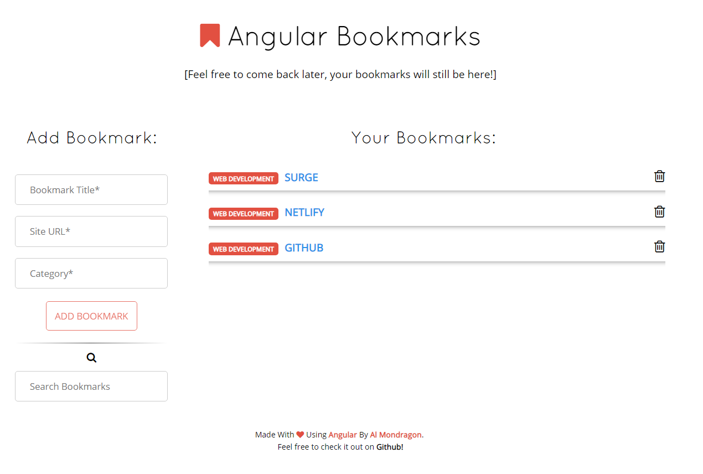
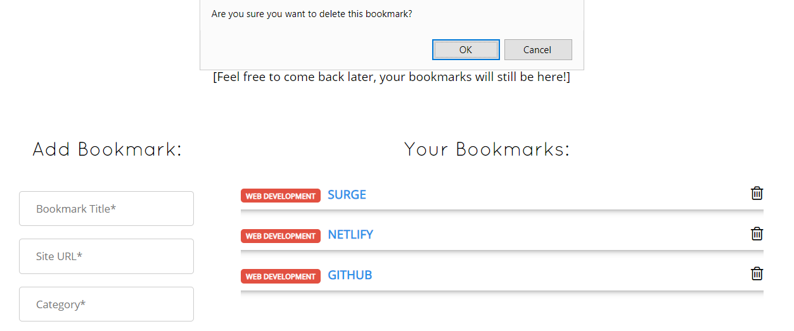
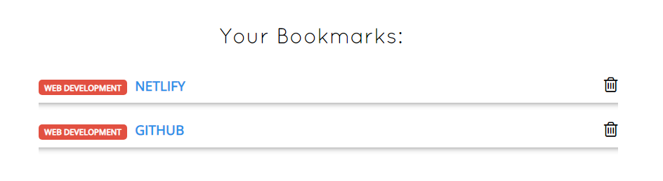
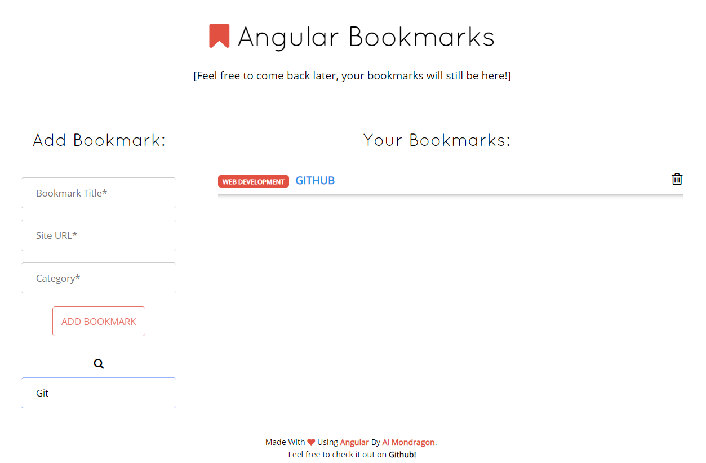
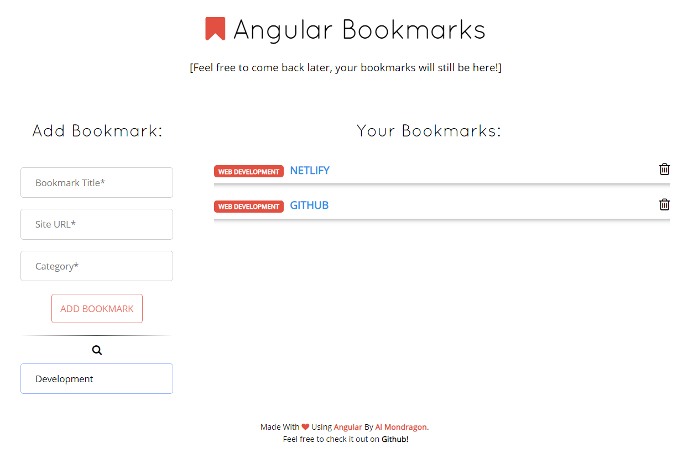

Esta app fue creada con **AngularJS** y tiene la capacidad para crear y eliminar las bookmarks que le des. Adicionalmente, puedes buscar a través de todos los bookmarks, la app usara tanto los títulos como las categorias de los mismos para tratas de encontrar la bookmark que estás buscando. 

Las bookmarks son persistentes y use LocalStorage para su preservación. A continuación, muestro unos screenshots mostrando las capacidades de esta web app:

Angular Notepad Con 3 Bookmarks

La App Preguntando Si Quieres Borrar La Bookmark

Las Lista Despues De Borrar Una Bookmark

Buscando Usando El Titulo

Buscando Usando La Categoria

<a href="http://ngbx.surge.sh/" class="btn">Ver La App En Vivo</a>
