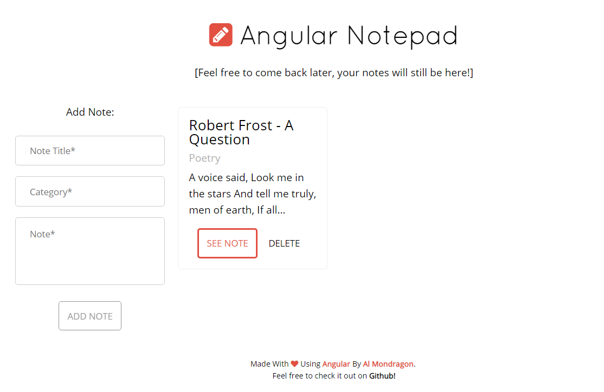

The client, Doja, requested photography for it's new iOS and Android application. The photos would act the background image for primary categories on a touch-based carousel navigation. The goal was to capture each category, from edibles to flowers to topicals.

Screenshot De La App

