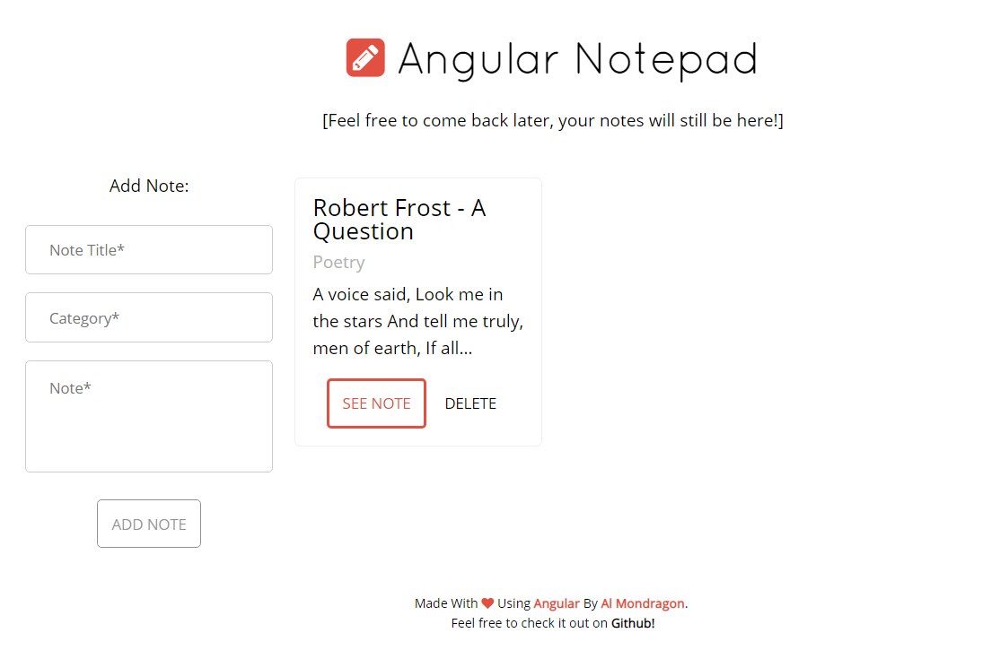
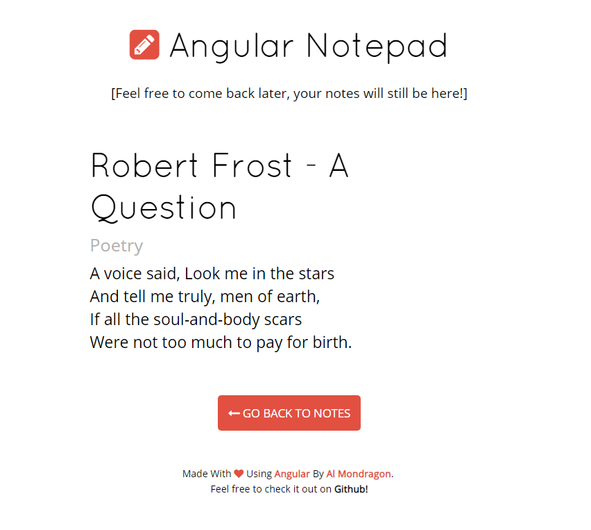
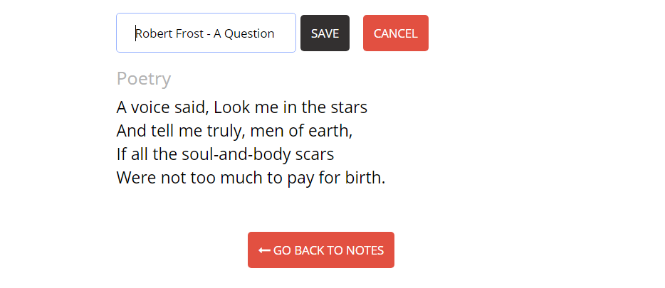
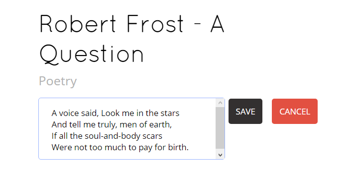

Este proyecto fue creado con **AngularJS** y tiene capacidad para crear, editar, guardar y eliminar todas las notas que quieras. Las notas son persistentes y use LocalStorage para su preservación. A continuación, muestro unos screenshots mostrando las capacidades de esta web app: 

Angular Notepad Con Una Nota

Pantalla Con La Nota Enfocada

Editando El Titulo

Editando La Categoría

Editando El Cuerpo De La Nota

<a href="http://ngpad.surge.sh/" class="btn">Ver La App En Vivo</a>
