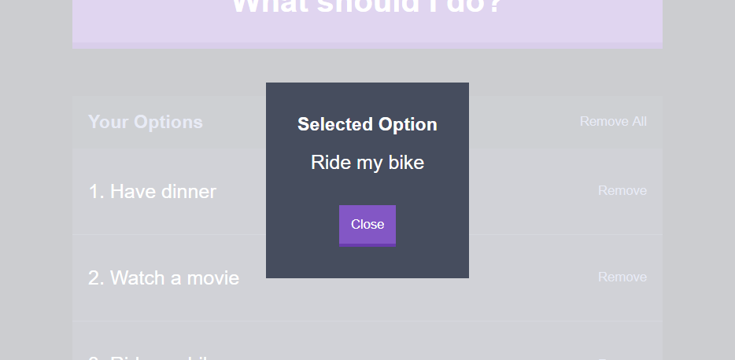

Este proyecto fue creado con **React** y tiene capacidad para tomar decisiones por ti basado en las opciones que le des. La app toma la serie de opciones y después de escoger una al azar, te la muestra en un modal. 

Las opciones son persistentes y usan LocalStorage para su preservación. Las mismas pueden ser editadas, guardadas de nuevo y eliminadas en unidad o todas a la vez a consideración del usuario. A continuación, muestro unos screenshots mostrando las capacidades de esta web app:

Tratando De Añadir Una Opción A La Lista

La App Con 3 Opciones

La App Diciendonos Cual Opción Fue Seleccionada

La App Despues De Eliminar Una Opción

La App Despues De Eliminar Todas Las Opciones

<a href="https://decidr.netlify.com/" class="btn">Ver La App En Vivo</a>
