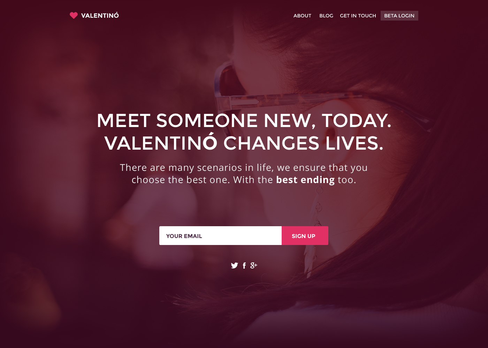
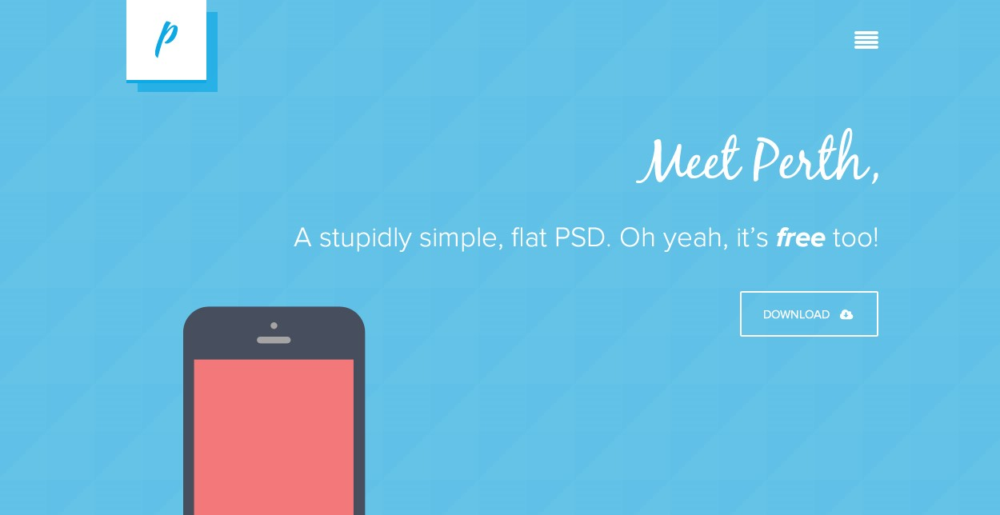
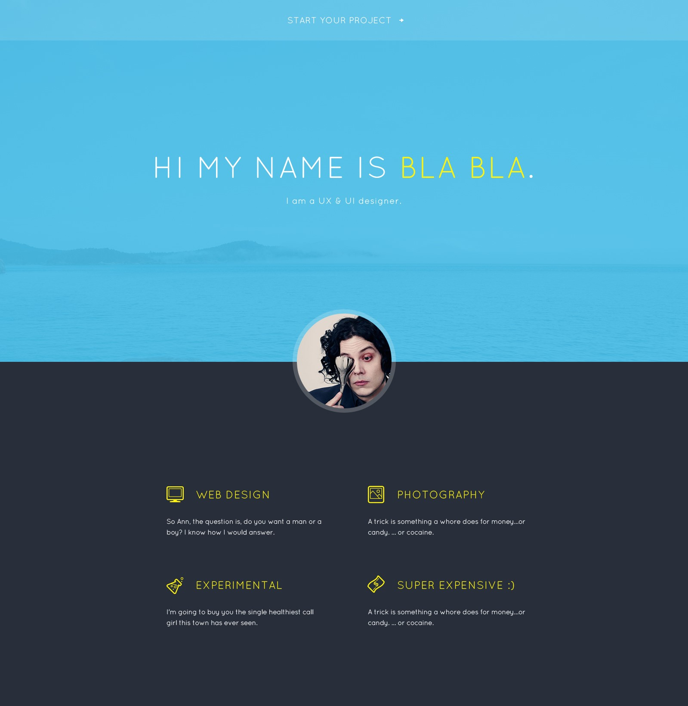
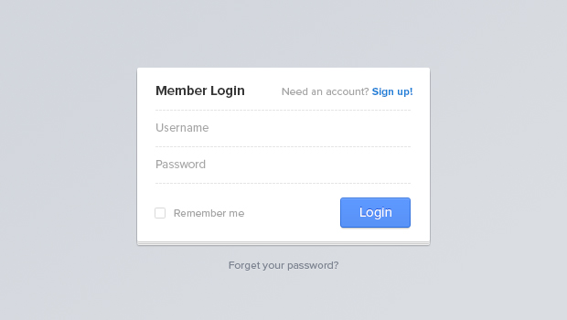
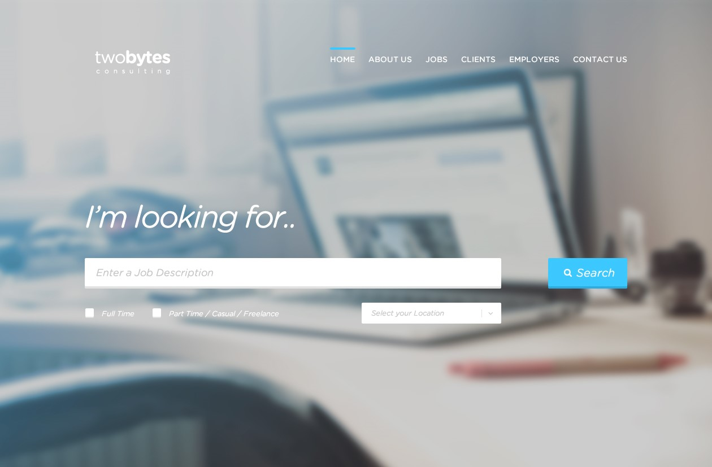

Maquetar sitios web siempre ha sido una parte importante de mi kit de herramientas como desarrollador front end. Siendo este el caso, me propuse a crear un proyecto que pusiera a la prueba mis músculos de desarrollo con HTML & CSS.

Web Dev 30 consiste en un proyecto donde tome un archivo de PSD, lo corte y maquete para ser un sitio web completo todos los días por 30 días consecutivos. Los sitios están en vivo y disponibles en GitHub ya que decidí hacerlos 100% de fuente abierta. 

Valentino - Dia #1

Perth - Dia #8  

Jack - Dia #16

Log In - Dia #24

Two Bytes - Dia #30

<a href="https://github.com/AlMon/Web-Dev-30" class="btn">Repositorio De GitHub Con Mis 30 Sitios</a></p