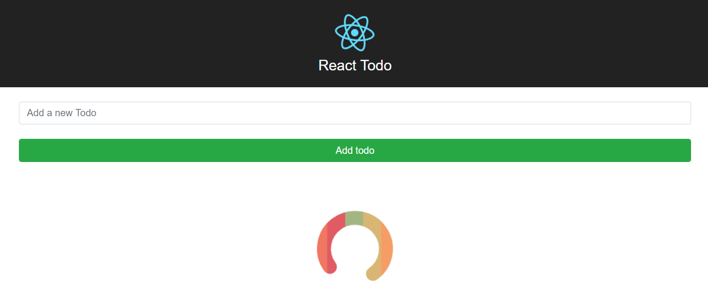
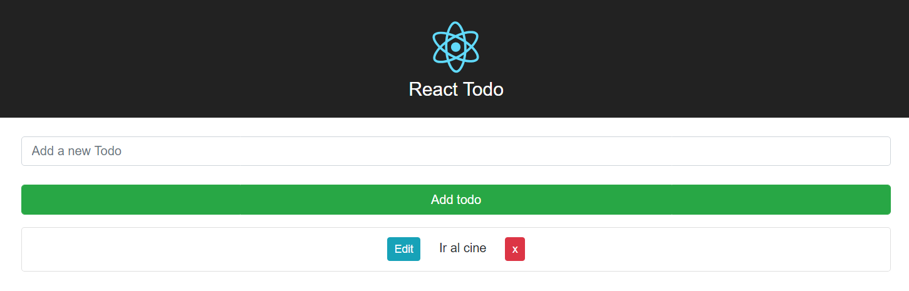
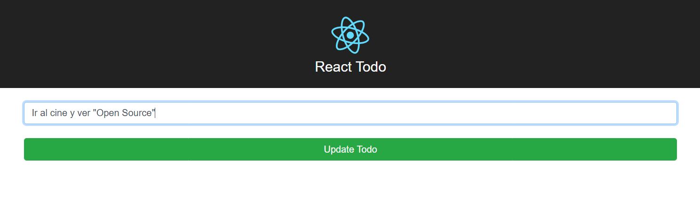
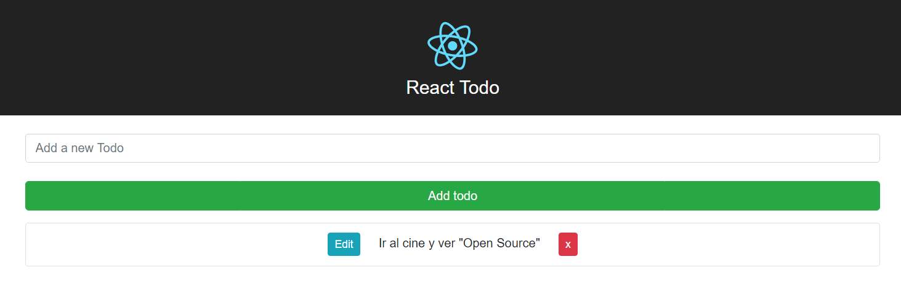
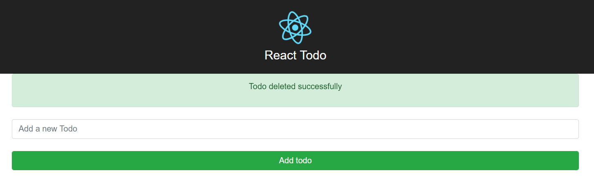

Este proyecto fue creado con **React** y tiene capacidad para crear, editar, guardar y eliminar todos los ToDos que quieras. 

Los ToDos son persistentes y la app está conectada a una API real usando libreria Axios para manejar las operaciones de interactividad con la API, la cual le da opciones colaborativas a la app, entonces cualquier ToDo que pongas ahí, permanecerá visible hasta que tu o alguien más la elimine de la lista. 

Los ToDos pueden ser editadas, guardadas de nuevo y eliminadas. A continuación, muestro unos screenshots mostrando las capacidades de esta web app:

La App Cargando Los ToDos

La App Con Un ToDo Pendiente

Editando El ToDo

La App Mostrando El ToDo Editado

La App Confirmando Que Se Borro Un ToDo

<a href="https://rtd.netlify.com/" class="btn">Ver La App En Vivo</a>
